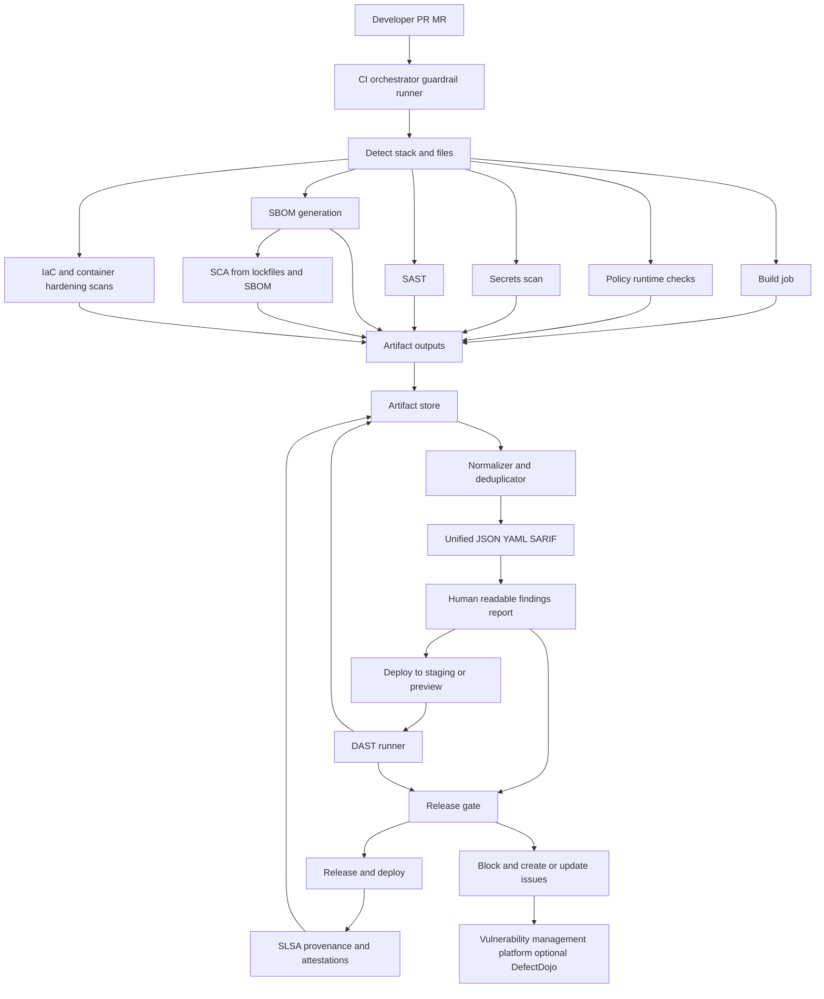

# Automated Guardrail Assessment Tool Plan for Small Software Firms in Vietnam

## Executive summary

**Related documents:** [vietnam_market_research.md](vietnam_market_research.md) (market research and competitive gaps this tool addresses) | [certifications.md](certifications.md) (consultant certification guide)

This plan describes how to build an automated, repeatable “guardrail assessment” toolchain that converts your A–H guardrails into CI/CD-executable tests across four assessment categories: **Runtime & Framework**, **Third‑Party Dependencies & Supply Chain**, **Secure Coding, Configuration & Secrets**, and **Version Control/Deployment, Vulnerability Management & Security Testing**. The output is a set of **standardized artifacts** (SBOMs, vulnerability findings, SAST/DAST results, provenance/attestations, and a human-readable report mapped to ASVS/SSDF/OWASP Top 10) that you can deliver consistently to developer teams as a consultant.

The core design is an **orchestrator + adapters** model:
- A small CLI (“guardrail-runner”) executes a deterministic sequence of scanners and policy checks, normalizes outputs, and produces a single consolidated report bundle.
- CI (GitHub Actions / GitLab CI or self-hosted runners) runs the pipeline automatically on PR/MR and release, storing artifacts and enforcing severity gates.
- Supply chain deliverables include **SBOM generation** (CycloneDX/SPDX) and **provenance/attestation** aligned with SLSA concepts of provenance and build integrity.

Everything below prioritizes **free and open-source** tools; any paid options are clearly marked as “paid”.

---

## Standards baseline and key assumptions

**Standards baseline (for credibility and consistent mapping).** The report outputs and control mappings should align to:
- **SSDF (SP 800-218)** for secure software development practices and vulnerability response structure.
- **ASVS** (use v5.0.0 as a reference requirements set) and **WSTG** (methodology framing to justify DAST scope).
- **OWASP Top 10:2025** for the developer-facing “what risk class is this?” communication in findings.
- **SLSA** provenance/levels language for supply chain integrity deliverables (even if you implement only partial levels initially).
- **CycloneDX** and **SPDX** as SBOM formats.
- **SARIF** as a structured results format for SAST integration with developer platforms.

**Assumptions (explicit).**
- The pipeline has outbound network access to fetch vulnerability databases/registries (OSV, NVD mirrors, etc.) and container base images.
- DAST runs only against **staging/non-production** endpoints (or ephemeral previews). You maintain an allowlist of approved targets and require explicit opt-in for active scans. (ZAP “baseline” is designed to be non-attack/passive-focused; “full/api” scans are active.)
- No single tech stack is assumed; the tool supports detection and conditional execution for **Node.js, Python, Java, .NET** based on repository signals (lockfiles, manifests, Dockerfile, CI variables). **PHP** is common in the Vietnamese market and should be added as a supported stack in the multi-runtime hardening phase (Composer lockfile detection, PHP-specific Semgrep rulesets, and SBOM support via Syft).

---

## Guardrail-to-test mapping table

The table below maps each guardrail item to **specific automated tests**, a **test type** (SAST/DAST/SCA/infra scan/secret scan/SBOM/SLSA checks/threat-model checklist), and recommended tools (OSS-first).

> Tooling references: SBOM via Syft (CycloneDX/SPDX). SCA via OSV-Scanner and/or OWASP Dependency-Check and/or Grype. SAST via Semgrep CE. Secrets via Gitleaks. IaC/misconfig via Trivy/Checkov. Dockerfile via Hadolint. DAST via OWASP ZAP baseline/api scan. Repo hygiene via OpenSSF Scorecard. GitHub SLSA provenance via slsa-github-generator (and GitLab SLSA options exist).

| Guardrail item | Automated test(s) to implement | Test type | OSS tools (preferred) |
|---|---|---|---|
| A1 Application targets a supported runtime | Detect runtime from repo (Docker base image, `.nvmrc`, `package.json engines`, `pyproject.toml`, `pom.xml`, `global.json`, etc.); compare against support matrix | infra scan / policy check | Custom `runtime-detector` + vendor policy sources (Node/Python/.NET docs) |
| A2 Runtime version is not near end-of-life | Evaluate runtime version against policy thresholds (for example, already EOL or within a configured “days-to-EOL” window); fail the build when the threshold is violated | infra scan / policy check | Custom check; use vendor lifecycle references (Node EOL, Python devguide, .NET policy) |
| A3 No deprecated frameworks introduced | Detect addition of deprecated frameworks/packages (denylist); detect “deprecated” metadata where available | SCA / policy check | OSV-Scanner + custom denylist; optional registry metadata checks |
| A4 No obsolete language features used | Compile/lint with warnings; Semgrep rules for disallowed constructs | SAST | Semgrep CE; language linters (eslint, pylint/ruff, dotnet analyzers, maven compiler warnings) |
| B1 Dependency list documented | Generate SBOM on every run; publish `sbom.cdx.json` and `sbom.spdx.json`; optionally auto-generate `DEPENDENCIES.md` from SBOM | SBOM | Syft; CycloneDX CLI (validate/convert) |
| B2 All major libraries include version numbers | Enforce lockfiles present; enforce versions set in manifests; block unversioned Maven/Gradle dependencies | SCA / policy check | Custom lockfile/version checks + OSV-Scanner supports multiple lockfile types |
| B3 No unsupported or abandoned packages | Heuristic “dependency health” check: repo archived flag, last release age, OpenSSF Scorecard score below threshold | SCA / policy check | OpenSSF Scorecard (for dependency repos where resolvable) |
| B4 No known critical vulnerabilities in dependencies | Scan lockfiles/SBOM for known vulnerabilities; gate on severity | SCA | OSV-Scanner; OWASP Dependency-Check; Grype (scan SBOM) |
| B5 Dependencies are version-locked (no floating “latest”) | Require lockfiles; disallow unbounded version specs; for Docker, require base images pinned by digest | SCA / infra scan | Custom checks + OpenSSF Scorecard “pinned dependencies” concept (hash pinning) |
| C1 All DB access uses parameterized queries | Pattern rules for unsafe query construction; language-specific checks | SAST | Semgrep CE + custom rules; reference OWASP SQLi prevention guidance |
| C2 No dynamic SQL string concatenation | Detect concatenation/interpolation into queries; fail on match | SAST | Semgrep CE rules (SQL concat/interpolation) |
| C3 All input validation is server-side | Detect “client-only” validation patterns; require server-side validation middleware or schema validation; flag missing validation at API boundaries | SAST / threat-model checklist | Semgrep CE heuristics + checklist gate (see “threat-model checklist” runner) |
| C4 No custom cryptography implemented | Flag homegrown crypto primitives, weak algorithms, insecure modes; flag “roll your own crypto” patterns | SAST | Semgrep CE rules + targeted greps; align messaging to OWASP crypto failure category |
| C5 No unnecessary custom authentication logic | Detect custom auth endpoints/tokens where framework auth exists; require central auth library usage; flag duplicate auth flows | SAST / threat-model checklist | Semgrep CE + checklist prompts (auth architecture) |
| C6 Sensitive information not exposed in logs | Detect logging of secrets/PII patterns; scan log statements; require log redaction helpers | SAST | Semgrep CE + secret patterns; align to OWASP logging risk language |
| C7 Stack traces not visible to end users | DAST “error handling” probes to trigger exceptions; detect stack trace markers; check debug endpoints | DAST | ZAP passive/baseline + custom HTTP probes; optional ZAP full scan in staging |
| C8 Debug mode disabled in production | Scan config for debug flags; verify prod config files differ; optionally runtime check in staging (`/health` returns env) | infra scan / SAST | Trivy misconfig (IaC), Semgrep config rules, custom runtime probe |
| D1 No hardcoded credentials | Scan git history + working tree for secrets | secret scan | Gitleaks (repo + history) |
| D2 No hardcoded env-specific paths or ports | Detect hardcoded `/prod/…`, absolute paths, fixed ports in code | SAST | Semgrep CE rules (paths/ports) |
| D3 Configuration separated from source logic | Require external config patterns (env vars, config files); detect “config constants” in code; enforce 12-factor style | SAST / policy check | Semgrep CE + repository policy checks (presence of config templates) |
| D4 Secrets not committed to repository | Enforce `.gitignore` patterns; scan history; block merges on detection | secret scan / policy check | Gitleaks + CI gate |
| E1 Code resides in approved Git repository | Check git remote origin against allowlist; require signed commits/releases (optional) | policy check | Custom check + OpenSSF Scorecard (branch protection etc.) |
| E2 No evidence of direct production edits | Require GitOps evidence: deployments must reference immutable artifact digest + provenance; flag missing evidence | SLSA checks / policy check | Cosign attestations + provenance bundle; (GitLab/GitHub provenance features vary) |
| E3 Prod and non-prod separated | IaC policy checks for separate namespaces/projects/accounts; block `prod` changes without approvals | infra scan / threat-model checklist | Checkov + Trivy misconfig + checklist gate |
| E4 Build reproducible from repository | Build twice in clean env; compare artifact hashes; diff outputs to detect nondeterminism | SLSA checks / infra scan | diffoscope; reproducible-builds definition framing |
| F1 Vulnerabilities tracked in issue system | Auto-create/update issues or import into vulnerability tracker; de-duplicate by fingerprint | policy check | OWASP DefectDojo (optional central platform) |
| F2 Severity ratings assigned | Normalize tool severities into unified scale (CVSS + CWEs + OWASP categories); require severity field non-empty | policy check | Custom normalizer; tool metadata; OWASP Top 10 labelling |
| F3 Critical issues resolved prior to release | Release gate: fail pipeline if `critical/high` unresolved (unless approved exception) | policy check | CI gating + exception workflow (YAML allowlist) |
| F4 Repeated patterns reviewed for root cause | Trend analysis across runs: recurring finding fingerprint > N times triggers “RCA required” item | policy check | Custom trend job + artifact history store |
| G1 Static analysis performed | Run SAST + secrets + SCA in CI on each PR/MR | SAST / secret scan / SCA | Semgrep CE; Gitleaks; OSV-Scanner |
| G2 Significant findings addressed | Require explicit triage status; block merge if not triaged; optional SARIF upload for code scanning UI | policy check | SARIF export; Git platform integrations |
| G3 Security review for critical apps | Manual approval gate for `critical` tag; require `SECURITY_REVIEW.md` sign-off | threat-model checklist / policy check | CI approvals + checklist artifact |
| G4 Testing in non-production | Enforce DAST only against allowlisted staging URLs; fail if target matches prod patterns | DAST / policy check | ZAP scripts + strict allowlist; ZAP baseline is non-attack oriented |
| H1 Unused services disabled | Scan IaC for unnecessary services/ports; detect exposed ports vs allowlist | infra scan | Trivy misconfig + Checkov; optional runtime port check in staging |
| H2 No unnecessary exposed endpoints | Compare OpenAPI/route list to exposure policies; scan for debug/admin routes; ZAP crawl surface | DAST / threat-model checklist | ZAP baseline/api scan + checklist |
| H3 Least privilege applied | IaC checks: no privileged containers, runAsNonRoot, minimal RBAC; Dockerfile hardening | infra scan | kube-linter + kube-bench (cluster) + Hadolint + Trivy/Checkov |
| H4 No reliance on client-side validation alone | Require server-side schema validation at API boundaries; detect “only frontend validation” patterns | SAST / threat-model checklist | Semgrep heuristics + checklist |

---

## Orchestration architecture

The architecture is designed for **low-friction adoption** in small teams: one repo-local config file, mostly containerized scanners, and consistent artifacts.



Design notes:
- SBOM is generated **early** (from workspace and/or built image) so later steps can reuse it for SCA and reporting. CycloneDX and SPDX are both supported; CycloneDX has a mature CLI for validation and conversion.
- Provenance & supply chain outputs should speak SLSA vocabulary: provenance is an attestation describing how artifacts were built, and higher SLSA levels tighten requirements.
- The release gate is evaluated after static scans and after DAST (when DAST is enabled), so release decisions use the full finding set.
- CI artifacts are stored as build artifacts (GitHub Actions artifacts / GitLab artifacts) or optionally in an object store (MinIO/S3); the plan keeps artifact storage pluggable.

---

## Detailed implementation plan

**Component breakdown (build these).**

**Guardrail runner (CLI + config)**
- `guardrail.yaml` (policy + toggles + thresholds):
  - `approved_git_origins` (domain allowlist)
  - `runtime_policy` (min supported versions + “near EOL” window)
  - `severity_gates` (block on `critical/high`)
  - `dast_targets_allowlist` (explicit non-prod URLs)
  - `tool_enablement` toggles (SAST/SCA/DAST/etc.)
  - `exceptions` referencing a signed/approved exceptions file
- `guardrail-runner` CLI responsibilities:
  - Detect stack and files, plan the execution graph
  - Execute scanners (mostly via Docker images for reproducibility)
  - Collect outputs into a common staging directory
  - Normalize to unified schema; generate Markdown report; exit with correct code

**Adapters (thin wrappers per tool)**
- `tools/semgrep/` → run Semgrep, output JSON + SARIF.
- `tools/gitleaks/` → run Gitleaks against history.
- `tools/syft/` → generate CycloneDX + SPDX SBOMs.
- `tools/osv/` and `tools/dependency-check/` → run SCA.
- `tools/trivy/` and/or `tools/checkov/` → IaC/misconfig.
- `tools/zap/` → baseline scan and API scan (OpenAPI/GraphQL/SOAP).
- `tools/hadolint/` → Dockerfile lint/hardening.
- `tools/scorecard/` → repo hygiene checks to support E/F items.

**Normalizer + reporter**
- Parse outputs, map to:
  - ASVS control references (at least “chapter + requirement id” for common items)
  - SSDF practice buckets (Prepare/Protect/Produce/Respond) at a coarse level
  - OWASP Top 10:2025 category labels for developer-friendly framing
- Generate:
  - `findings.json` (canonical)
  - `findings.yaml` (human-greppable)
  - `findings.sarif` (optional upload)
  - `report.md` (client deliverable)
  - `sbom.cdx.json`, `sbom.spdx.json`
  - `provenance/*` (SLSA/cosign bundles)

**Data inputs your pipeline should accept**
- Source directory (repo workspace)
- Optional: a built container image reference (preferred for “what actually ships” scans)
- Optional: OpenAPI spec (local path or URL) for ZAP API scan
- DAST target base URL (must match allowlist)
- Optional: authentication for staging (prefer short-lived tokens; never store in repo)

**Execution order (deterministic, parallel where safe)**
1. **Preflight**: detect stack + required files; validate `guardrail.yaml`; validate DAST allowlist.
2. **Fast fail safety**: secrets scan (Gitleaks) early to stop obvious leaks.
3. **SBOM generation**: Syft from workspace and/or image; validate with CycloneDX CLI.
4. **SCA** (parallel):
   - OSV-Scanner against lockfiles for fast dependency matching and introduced-vulnerability gating.
   - OWASP Dependency-Check (where ecosystem fit is good, especially Java) for CVE linkage expectations in some orgs.
   - Grype scanning the SBOM/image for OS package + language package coverage.
5. **SAST** (parallel):
   - Semgrep with curated rulesets + your custom “guardrail rules”. Semgrep CE can emit SARIF/JSON outputs.
6. **IaC/Docker hardening checks** (parallel):
   - Trivy misconfiguration scanning across Docker/K8s/Terraform, including custom policies if needed.
   - Checkov for policy-as-code IaC rules.
   - Hadolint for Dockerfile best practices.
7. **Build & reproducibility checks**:
   - Build artifacts in a clean runner image; rebuild twice; compare hashes; on mismatch, run diffoscope to explain drift.
8. **DAST** (requires deployed target):
   - Prefer ZAP baseline scan for “safe-by-default” in CI, then optionally run API scan in staging when OpenAPI is available.
9. **Normalize + report**:
   - Merge outputs into the unified schema and generate `findings.json`, `findings.yaml`, and `report.md`.
10. **Release gate**:
   - Evaluate severity thresholds and policy checks across static scans and DAST results (if DAST ran).
11. **Provenance / attestations**:
   - Generate provenance and signing artifacts for release artifacts that pass the gate.
   - GitHub: slsa-github-generator can generate SLSA Build Level 3 provenance for GitHub-native builds.
   - GitLab: GitLab documents SLSA provenance options and references SLSA provenance specs; treat this as “platform-dependent.”

**Parallelization model**
- Run SAST, secrets, SBOM, SCA, IaC, Dockerfile lint in parallel jobs to reduce CI time.
- DAST depends on staging deployment, while provenance/attestations depend on finalized release artifacts.
- The normalizer/reporter job runs after all scan jobs finish (but should still produce a report even with partial data).

**Failure handling (consulting-friendly)**
- Implement “fail closed” only for:
  - secrets found
  - critical/high vulnerabilities that violate configured thresholds
  - explicit policy violations (e.g., production DAST target, missing lockfile)
- Implement “fail open with warning” for:
  - flaky DAST, timeouts, or scanner crashes (still produce report and note reduced coverage)
  - dependency health heuristics (abandonment score) because metadata signals can be noisy
- All failures must preserve artifacts and include a “what ran / what did not run” summary.

**Secrets management (do not ship risk into your own tooling)**
- Use CI secret stores (GitHub Actions secrets / GitLab CI variables) for staging credentials.
- Do not export secrets into logs; ensure scanner commands redact env vars.
- Enforce “no PII/secrets” in generated reports by default; store raw request/response bodies only when explicitly enabled and scrubbed. OWASP Top 10:2025 explicitly calls out logging sensitive information as a risk.

---

## CI/CD examples (GitHub Actions and GitLab CI)

### GitHub Actions reference workflow (OSS-first)

> Notes:  
> - Semgrep CE can output SARIF/JSON.  
> - ZAP baseline scan is designed to run quickly and does not perform active attacks by default.  
> - slsa-github-generator is OSS and focuses on SLSA Build Level 3 provenance for GitHub Actions builds.  
> - GitHub’s native artifact attestations feature has plan limitations for private repos; treat it as optional.

```yaml
name: guardrail-full

on:
  pull_request:
  push:
    branches: ["main"]
  workflow_dispatch:

permissions:
  contents: read

jobs:
  preflight:
    runs-on: ubuntu-latest
    outputs:
      dast_target: ${{ steps.out.outputs.dast_target }}
    steps:
      - uses: actions/checkout@v4
      - id: out
        run: |
          # Example: only run DAST if an explicit staging URL exists.
          # In practice, set this via repo vars or environment rules.
          echo "dast_target=${{ vars.STAGING_BASE_URL }}" >> "$GITHUB_OUTPUT"

  secrets:
    runs-on: ubuntu-latest
    needs: [preflight]
    steps:
      - uses: actions/checkout@v4
        with:
          # Needed so Gitleaks can inspect full history, not only the latest commit.
          fetch-depth: 0
      - name: Gitleaks (history + workspace)
        uses: gitleaks/gitleaks-action@v2
        with:
          args: "--redact --report-format json --report-path gitleaks.json"

      - uses: actions/upload-artifact@v4
        with:
          name: secrets
          path: gitleaks.json

  sbom:
    runs-on: ubuntu-latest
    needs: [preflight]
    steps:
      - uses: actions/checkout@v4

      - name: Generate SBOM (CycloneDX + SPDX) via Syft
        run: |
          curl -sSfL https://raw.githubusercontent.com/anchore/syft/main/install.sh | sh -s -- -b /usr/local/bin
          syft dir:. -o cyclonedx-json=sbom.cdx.json
          syft dir:. -o spdx-json=sbom.spdx.json

      - name: Validate CycloneDX SBOM
        run: |
          curl -sSfL https://github.com/CycloneDX/cyclonedx-cli/releases/latest/download/cyclonedx-linux-x64 -o cyclonedx
          chmod +x cyclonedx
          ./cyclonedx validate --input-file sbom.cdx.json

      - uses: actions/upload-artifact@v4
        with:
          name: sbom
          path: |
            sbom.cdx.json
            sbom.spdx.json

  sca:
    runs-on: ubuntu-latest
    needs: [sbom]
    steps:
      - uses: actions/checkout@v4

      - name: OSV-Scanner (lockfiles)
        uses: google/osv-scanner-action@v2
        with:
          scan-args: |-
            --format=json
            --output=osv.json
            .

      - name: Grype (scan SBOM for vulnerabilities)
        run: |
          curl -sSfL https://raw.githubusercontent.com/anchore/grype/main/install.sh | sh -s -- -b /usr/local/bin
          # Download SBOM artifact produced earlier
          # (in practice use actions/download-artifact)
          echo "Run grype against sbom.cdx.json once downloaded"
        continue-on-error: true

      - uses: actions/upload-artifact@v4
        with:
          name: sca
          path: |
            osv.json

  sast:
    runs-on: ubuntu-latest
    needs: [preflight]
    steps:
      - uses: actions/checkout@v4

      - name: Semgrep CE (JSON + SARIF)
        run: |
          python -m pip install --upgrade pip
          pip install semgrep
          semgrep scan \
            --config auto \
            --json-output semgrep.json \
            --sarif-output semgrep.sarif \
            .

      - uses: actions/upload-artifact@v4
        with:
          name: sast
          path: |
            semgrep.json
            semgrep.sarif

  iac_container:
    runs-on: ubuntu-latest
    needs: [preflight]
    steps:
      - uses: actions/checkout@v4

      - name: Trivy misconfiguration scan (IaC)
        run: |
          curl -sSfL https://raw.githubusercontent.com/aquasecurity/trivy/main/contrib/install.sh | sh -s -- -b /usr/local/bin
          trivy config --format json --output trivy_config.json .

      - name: Hadolint (Dockerfile lint)
        run: |
          docker run --rm -i hadolint/hadolint < Dockerfile > hadolint.txt || true

      - uses: actions/upload-artifact@v4
        with:
          name: infra
          path: |
            trivy_config.json
            hadolint.txt

  dast:
    runs-on: ubuntu-latest
    needs: [preflight]
    steps:
      - name: OWASP ZAP baseline scan (staging only)
        run: |
          TARGET="${{ needs.preflight.outputs.dast_target }}"
          if [ -z "$TARGET" ]; then
            echo "No staging target set; skipping DAST."
            exit 0
          fi
          # Enforce allowlist in your own wrapper script before running.
          docker run --rm -t ghcr.io/zaproxy/zaproxy:stable zap-baseline.py \
            -t "$TARGET" \
            -J zap.json \
            -r zap.html || true

      - uses: actions/upload-artifact@v4
        with:
          name: dast
          if-no-files-found: ignore
          path: |
            zap.json
            zap.html

  report:
    runs-on: ubuntu-latest
    needs: [secrets, sbom, sca, sast, iac_container, dast]
    if: always()
    steps:
      - uses: actions/checkout@v4
      - uses: actions/download-artifact@v4
        with:
          path: artifacts

      - name: Build consolidated report bundle
        run: |
          # Placeholder: your guardrail-runner normalizer would load tool outputs,
          # dedupe, map to ASVS/SSDF/OWASP Top10, and generate report.md + findings.json.
          ls -R artifacts
          echo "# Findings Report" > report.md
          echo "Generated: $(date -u)" >> report.md

      - uses: actions/upload-artifact@v4
        with:
          name: report-bundle
          path: |
            report.md
            artifacts

  gate:
    runs-on: ubuntu-latest
    needs: [report]
    if: always()
    steps:
      - uses: actions/download-artifact@v4
        with:
          name: report-bundle
          path: gate_input

      - name: Enforce severity and policy gates
        run: |
          # Placeholder: parse findings.json from your report bundle and fail on:
          # - unresolved critical/high findings
          # - hard policy violations (for example, production DAST target)
          echo "Implement gate evaluation logic in guardrail-runner."
```

### GitLab CI reference pipeline (OSS-first)

> Notes:  
> - GitLab documents Sigstore keyless signing examples using cosign for images built in GitLab CI/CD.  
> - GitLab documents SLSA provenance generation options and references SLSA provenance specifications; treat availability as edition/feature-dependent and keep your plan flexible.  

```yaml
stages:
  - preflight
  - scan
  - build
  - dast
  - report
  - gate
  - attest

variables:
  GUARDRAIL_ARTIFACTS: "guardrail_artifacts"

preflight:
  stage: preflight
  image: alpine:3.20
  script:
    - apk add --no-cache bash git
    - echo "Preflight: validate allowlists, detect stack"
    - mkdir -p "$GUARDRAIL_ARTIFACTS"
  artifacts:
    when: always
    paths:
      - $GUARDRAIL_ARTIFACTS/

secrets_scan:
  stage: scan
  image: zricethezav/gitleaks:latest
  script:
    - gitleaks detect --redact --report-format json --report-path "$GUARDRAIL_ARTIFACTS/gitleaks.json" || exit 1
  artifacts:
    when: always
    paths:
      - $GUARDRAIL_ARTIFACTS/gitleaks.json

sbom:
  stage: scan
  image: alpine:3.20
  script:
    - apk add --no-cache curl
    - curl -sSfL https://raw.githubusercontent.com/anchore/syft/main/install.sh | sh -s -- -b /usr/local/bin
    - syft dir:. -o cyclonedx-json="$GUARDRAIL_ARTIFACTS/sbom.cdx.json"
    - syft dir:. -o spdx-json="$GUARDRAIL_ARTIFACTS/sbom.spdx.json"
  artifacts:
    when: always
    paths:
      - $GUARDRAIL_ARTIFACTS/sbom.cdx.json
      - $GUARDRAIL_ARTIFACTS/sbom.spdx.json

sca:
  stage: scan
  image: alpine:3.20
  script:
    - apk add --no-cache curl
    - curl -sSfL https://github.com/google/osv-scanner/releases/latest/download/osv-scanner_linux_amd64 -o /usr/local/bin/osv-scanner
    - chmod +x /usr/local/bin/osv-scanner
    - osv-scanner scan --format=json --output="$GUARDRAIL_ARTIFACTS/osv.json" .
  artifacts:
    when: always
    paths:
      - $GUARDRAIL_ARTIFACTS/osv.json

sast_semgrep:
  stage: scan
  image: python:3.12-alpine
  script:
    - pip install semgrep
    - semgrep scan --config auto --json-output "$GUARDRAIL_ARTIFACTS/semgrep.json" .
  artifacts:
    when: always
    paths:
      - $GUARDRAIL_ARTIFACTS/semgrep.json

build_candidate:
  stage: build
  image: alpine:3.20
  script:
    - mkdir -p "$GUARDRAIL_ARTIFACTS"
    - echo "Placeholder build step: produce the release candidate artifact/image."
  artifacts:
    when: always
    paths:
      - $GUARDRAIL_ARTIFACTS/

dast_zap:
  stage: dast
  image: docker:27
  services:
    - docker:27-dind
  script:
    - |
      if [ -z "$STAGING_BASE_URL" ]; then
        echo "No staging target set; skipping DAST."
        exit 0
      fi
    - docker run --rm -t ghcr.io/zaproxy/zaproxy:stable zap-baseline.py -t "$STAGING_BASE_URL" -J "$GUARDRAIL_ARTIFACTS/zap.json" -r "$GUARDRAIL_ARTIFACTS/zap.html" || true
  artifacts:
    when: always
    paths:
      - $GUARDRAIL_ARTIFACTS/zap.json
      - $GUARDRAIL_ARTIFACTS/zap.html

report:
  stage: report
  image: alpine:3.20
  script:
    - echo "# Guardrail Findings Report" > "$GUARDRAIL_ARTIFACTS/report.md"
    - echo "Generated: $(date -u)" >> "$GUARDRAIL_ARTIFACTS/report.md"
    - ls -la "$GUARDRAIL_ARTIFACTS"
  artifacts:
    when: always
    paths:
      - $GUARDRAIL_ARTIFACTS/

gate:
  stage: gate
  image: alpine:3.20
  script:
    - echo "Placeholder gate: parse findings and fail on unresolved critical/high issues."

attest_cosign_keyless:
  stage: attest
  image: golang:1.22-alpine
  script:
    - apk add --no-cache cosign
    - echo "Optional: keyless sign container image with cosign (requires registry + OIDC settings)."
    - echo "See GitLab docs for Sigstore keyless signing examples."
  rules:
    - if: '$CI_COMMIT_TAG'
      when: on_success
```

Paid-only notes (keep out of MVP unless client pays):
- Platform-native “code scanning dashboards” may require paid tiers (example: some GitHub features for private repos).
- IAST is typically commercial in practice; treat as “paid-only” unless you adopt an OSS experimental approach (not recommended for MVP).

---

## Output formats, schemas, reporting template, and remediation snippets

### Output bundle (what your tool must always produce)

Minimum deliverables per run:
- `sbom.cdx.json` (CycloneDX) and `sbom.spdx.json` (SPDX)
- `findings.json` (canonical unified schema)
- `findings.yaml` (same content, human-greppable)
- `report.md` (client deliverable mapped to OWASP Top 10:2025 + ASVS + SSDF)
- Tool-native raw outputs (Semgrep JSON/SARIF, ZAP JSON/HTML, OSV JSON, etc.)
- `provenance/` directory (when enabled): SLSA provenance / signing bundles

Optional integration outputs:
- `findings.sarif` for uploading to code scanning systems (SARIF is a standard format used for static analysis results interchange).

### Sample unified report schema (JSON)

```json
{
  "metadata": {
    "toolchain_version": "0.1.0",
    "run_id": "2026-02-23T12:34:56Z",
    "repo": {
      "name": "example/service-a",
      "commit": "abcdef123456",
      "default_branch": "main"
    },
    "environment": {
      "ci_platform": "github-actions",
      "runner": "ubuntu-latest"
    }
  },
  "artifacts": {
    "sbom": {
      "cyclonedx": "sbom.cdx.json",
      "spdx": "sbom.spdx.json"
    },
    "provenance": {
      "type": "slsa-provenance",
      "files": ["provenance/intoto.jsonl"]
    }
  },
  "findings": [
    {
      "id": "SAST-SEMGRP-001234",
      "title": "Potential SQL injection via string concatenation",
      "severity": "high",
      "confidence": "medium",
      "guardrail_refs": ["C1", "C2"],
      "test_type": "SAST",
      "taxonomy": {
        "cwe": ["CWE-89"],
        "owasp_top10_2025": ["A05:2025 - Injection"]
      },
      "standards_mapping": {
        "asvs": ["V5.* (example)"],
        "ssdf": ["PW.4 (example)"]
      },
      "location": {
        "path": "src/db/userRepo.ts",
        "start_line": 88,
        "end_line": 96
      },
      "evidence": {
        "snippet_hash": "sha256:...",
        "tool_output_ref": "artifacts/sast/semgrep.json#runs[0]..."
      },
      "remediation": {
        "summary": "Use parameterized queries/prepared statements, avoid concatenation.",
        "references": ["OWASP SQL Injection Prevention Cheat Sheet"]
      }
    }
  ],
  "summary": {
    "counts_by_severity": { "critical": 0, "high": 2, "medium": 7, "low": 12 },
    "pipeline_status": "failed",
    "gates_triggered": ["critical_or_high_unresolved"]
  }
}
```

### Sample unified report schema (YAML)

```yaml
metadata:
  toolchain_version: 0.1.0
  run_id: "2026-02-23T12:34:56Z"
  repo:
    name: example/service-a
    commit: abcdef123456
findings:
  - id: SCA-OSV-000045
    title: "Vulnerable dependency: lodash < 4.17.21"
    severity: high
    guardrail_refs: ["B4"]
    test_type: SCA
    taxonomy:
      owasp_top10_2025: ["A03:2025 - Software Supply Chain Failures"]
summary:
  pipeline_status: failed
  counts_by_severity:
    high: 1
```

### Human-readable findings report template (Markdown)

Use this structure in `report.md` so it reads like an assessment deliverable:

```md
# Guardrail Assessment Report

## Scope
- Repo:
- Commit / tag:
- CI run:
- DAST target (non-prod):
- Assumptions / exclusions:

## Executive summary
- Overall result:
- Key risks aligned to OWASP Top 10:2025:
- Release readiness (pass/fail gates):

## Findings by guardrail category
### Runtime & Framework (A)
- Summary:
- Findings:

### Third-Party Dependencies & Supply Chain (B)
- Summary:
- SBOM artifacts: (CycloneDX/SPDX paths)
- Findings:

### Secure Coding, Configuration & Secrets (C–D)
- Summary:
- Findings:

### Version Control/Deployment, Vulnerability Mgmt & Security Testing (E–H)
- Summary:
- Findings:

## Standards mapping
- OWASP Top 10:2025 mapping
- ASVS mapping (reference)
- NIST SSDF mapping (reference)

## Vietnamese regulatory compliance mapping
- PDPL 2025 / Decree 356 obligations addressed by findings
- Cybersecurity Law 2025 (effective July 2026) relevant controls
- Decree 53/2022 data localization implications (if applicable)

## Appendix
- Tool versions
- Coverage notes (what ran / what did not run)
- Exceptions / risk acceptances
```

Standards references for mapping sections:
- OWASP Top 10:2025 category list.
- ASVS provides a basis for testing security controls and secure development requirements.
- SSDF provides a core set of secure software development practices.

### Remediation guidance snippets (common, high-frequency findings)

**Parameterized queries (avoid SQL injection).** OWASP recommends prepared statements / parameterized queries as a primary defense.

Node.js (example with parameter placeholders):
```js
const result = await client.query(
  'SELECT * FROM users WHERE email = $1',
  [email]
);
```

Python (example with DB-API parameters):
```py
cursor.execute("SELECT * FROM users WHERE email = %s", (email,))
```

Java (PreparedStatement):
```java
PreparedStatement ps = conn.prepareStatement("SELECT * FROM users WHERE email = ?");
ps.setString(1, email);
ResultSet rs = ps.executeQuery();
```

.NET (SqlParameter):
```csharp
using var cmd = new SqlCommand("SELECT * FROM Users WHERE Email = @email", conn);
cmd.Parameters.AddWithValue("@email", email);
```

**Secret rotation + no-secrets-in-repo policy.** Anchor your guidance to “centralize storage and enable rotation/auditing,” which is emphasized in OWASP secrets management guidance.  
Practical snippet for clients:
- Rotate any exposed token immediately; invalidate prior tokens.
- Add pre-commit + CI scanning to prevent recurrence (Gitleaks early in pipeline).
- Move secrets to CI secret store or secret manager; use short-lived credentials for CI whenever possible.

**Dependency upgrade policy (small-firm friendly).**
- Require lockfiles; only update dependencies via PR with SCA checks.
- Define SLA by severity (example: Critical: 7 days; High: 30 days).
- Gate release if Critical/High is present (your F3 rule).
- Maintain SBOM per release tag and store with release artifacts (CycloneDX/SPDX).

---

## Validation, QA plan, roadmap, and Vietnam compliance notes

### Validation & QA plan

**Test targets (known-vulnerable applications).**
- Use **OWASP Juice Shop** for web app findings across OWASP Top Ten classes.
- Use **OWASP WebGoat** for Java-focused vulnerabilities and secure coding checks.

**QA datasets**
- Seed repos with:
  - Known leaked test secrets (to ensure Gitleaks catches them)
  - Intentionally vulnerable dependency versions (to ensure OSV flags them)
  - Deliberate SQLi code patterns and safe parameterized versions (to measure false positives)
  - IaC misconfigurations (e.g., privileged containers, public S3 buckets in Terraform samples)

**Coverage and quality metrics (track over time)**
- Scanner coverage:
  - `% repos with SBOM produced`
  - `% repos with lockfiles/enforced pinning`
  - `% DAST executed successfully (staging reachable)`
- Finding quality:
  - False positive rate by scanner type (SAST vs IaC vs DAST)
  - Deduplication effectiveness (unique fingerprints / total raw alerts)
  - Mean time to triage (MTTT) and mean time to remediate (MTTR)
- “Guardrail completeness”:
  - `% guardrail items with automated evidence`
  - `% guardrail items requiring manual checklist confirmation`

### Phased roadmap (person-days; MVP first)

**Phase: MVP pipeline (deliverable you can sell quickly) — ~12–18 person-days**
- Implement orchestrator skeleton + config.
- Run: Gitleaks, Syft (SBOM), OSV-Scanner, Semgrep, Trivy config, ZAP baseline.
- Produce: `report.md` + unified `findings.json`.
- Gate: secrets + critical/high SCA + obvious policy violations.

**Phase: Multi-runtime hardening — ~10–15 person-days**
- Better stack detection for Node/Python/Java/.NET.
- Add OWASP Dependency-Check for Java-heavy clients.
- Add Hadolint + Kubernetes linting (kube-linter).

**Phase: Supply chain integrity deliverables — ~12–20 person-days**
- Add provenance/attestation outputs:
  - GitHub: integrate slsa-github-generator provenance generation.
  - GitLab: implement a portable cosign-based signing/attestation path; keep GitLab’s documented SLSA options as “platform feature” when available.
- Add reproducibility check (double-build + diffoscope) as warning gate at first.

**Phase: Consultant-grade reporting + vulnerability management — ~8–14 person-days**
- Improve ASVS/SSDF/Top10 mapping tables, executive summaries, and evidence excerpts.
- Optional: integrate OWASP DefectDojo for central triage and deduplication (especially when you manage multiple clients).

**Phase: Policy packs + client templates — ~6–10 person-days**
- Provide “policy packs” tuned to small firms (e.g., baseline vs strict).
- Provide repo templates (GitHub and GitLab) and a short onboarding checklist.

### Vietnam-specific compliance notes and data-handling guidance

**PDPL 2025 and Decree 356 (personal data protection).**
- Decree **356/2025/ND-CP** took effect **January 1, 2026** and replaced Decree **13/2023/ND-CP** from the same date (per English translations/summaries).
- Practical implication for your tooling: treat scan outputs (DAST captures, logs, screenshots) as potentially containing **personal data** if they include user identifiers, emails, session tokens, or production-like datasets. Keep reports “PII-minimal by default.”

**Decree 53 (cybersecurity law guidance / data localization & retention context).**
- Decree **53/2022/ND-CP** took effect **October 1, 2022** and is commonly described as elaborating Cybersecurity Law data retention/localization requirements for certain service providers in Vietnam.

**Data handling rules for SBOMs and reports (recommended defaults)**
- SBOMs should not contain PII, but can contain **internal component names, repo URLs, paths**, and build metadata; treat them as sensitive business information. CycloneDX/SPDX are designed to represent component metadata and relationships; do not enrich them with user data.
- Do not embed request/response bodies in reports unless scrubbed; OWASP Top 10:2025 explicitly warns about logging sensitive info (PII/PHI) and exposing data via logging/alerting failures.
- If you use SaaS CI platforms hosted outside Vietnam, minimize risk by ensuring reports contain **no hardcoded PII** and by stripping secrets; if a client is in a regulated sector, recommend storing artifacts in a controlled location and applying retention limits.

**Deliverable packaging suggestion (for consulting)**
- Provide clients a “baseline safe” mode by default (passive scans + strict allowlists).
- Provide an “enhanced testing” mode for mature clients (active API scan in staging, deeper fuzzing, etc.), aligned to WSTG methodology language.

**Prioritized sources (start here when implementing)**
- NIST SSDF SP 800-218.  
- OWASP ASVS (v5.0.0 reference).  
- OWASP Top 10:2025.  
- OWASP WSTG.  
- SLSA spec (levels + provenance).  
- CycloneDX specification + CLI.  
- SPDX (ISO/IEC 5962:2021 reference pages).  
- OSV-Scanner.  
- Semgrep CE (SARIF/JSON outputs).  
- Gitleaks.  
- Trivy misconfiguration scanning.  
- OWASP ZAP baseline/API scans.  
- Decree 356/2025/ND-CP effective date + replacement of Decree 13.  
- Decree 53/2022/ND-CP effective date + data localization context summaries.
